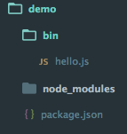
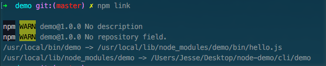

### 创建第一个cli

1. 创建项目并编写程序

	
	
	```javascript
	
		#!/usr/bin/env node
		// 脚本用env启动的原因，是因为脚本解释器在linux中可能被安装于不同的目录，
		// env可以在系统的PATH目录中查找。同时，env还规定一些系统环境变量。
		
	```

2. 修改package.json文件
	
	```javascript
		
		{
			...
			
			"bin": {
		   		"demo": "./bin/hello.js"
		  	},
		  	
			...
		}
	
	```
	
3. 执行npm link命令


 	

 